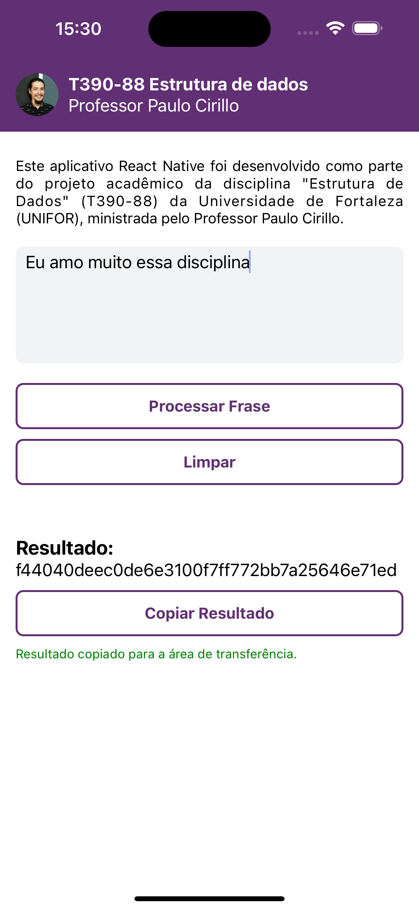

# Aplicativo de Processamento de Frases com Árvore Binária de Busca

Este aplicativo React Native foi desenvolvido como parte do projeto acadêmico da disciplina "Estrutura de Dados" (T390-88) da Universidade de Fortaleza (UNIFOR), ministrada pelo Professor Paulo Cirillo.

## Funcionalidades

1. **Entrada de Frase:**

   - O usuário pode inserir uma frase na caixa de texto fornecida.

2. **Processamento de Frase:**

   - Ao clicar no botão "Processar Frase", as palavras da frase são inseridas em uma Árvore Binária de Busca.

3. **Limpeza da Entrada:**

   - O botão "Limpar" permite que o usuário limpe o campo de entrada.

4. **Exibição do Resultado:**

   - O resultado do processamento da frase é exibido na tela.

5. **Cópia para Área de Transferência:**

   - O usuário pode copiar o resultado para a área de transferência clicando no botão "Copiar Resultado".

6. **Feedback de Cópia Bem-Sucedida:**
   - Um feedback é exibido caso a cópia para a área de transferência seja bem-sucedida.

## Como Funciona

O aplicativo utiliza uma implementação de Árvore Binária de Busca para organizar as palavras da frase. Cada palavra é inserida na árvore de acordo com sua ordenação lexicográfica, e o resultado é obtido percorrendo a árvore em ordem.

## Estrutura do Código

- **App.js:**

  - Contém a lógica principal do aplicativo, incluindo a manipulação da entrada do usuário, processamento da frase e interação com a interface.

- **BinarySearchTree.js:**

  - Define a classe `BinarySearchTree` que contém a lógica de manipulação da Árvore Binária de Busca, incluindo as classes `Node` e `Crypt` necessárias.

## Como Executar

1. Certifique-se de ter o ambiente React Native configurado.
2. Clone o repositório.
3. Execute `npm install` para instalar as dependências.
4. Execute o aplicativo usando um emulador ou dispositivo físico (`npm start` ou `expo start`).

## Observações

Este aplicativo foi desenvolvido como parte de um trabalho acadêmico para a disciplina de Estrutura de Dados da UNIFOR, sob a orientação do Professor Paulo Cirillo. Pode ser estendido para incluir mais funcionalidades ou otimizações na implementação da Árvore Binária de Busca.
